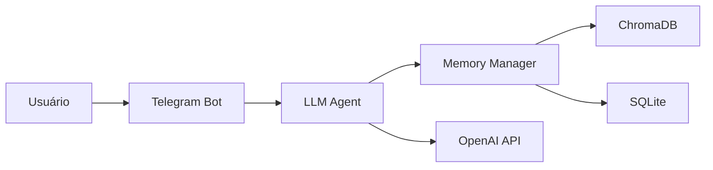

# Arquitetura do Projeto

## 1. Visão Geral
Este projeto é um bot do Telegram especializado em engenharia civil, com funcionalidades de gestão de obras, controle financeiro e processamento de documentos. O bot utiliza inteligência artificial (OpenAI) para processamento de linguagem natural e mantém um sistema de memória persistente.

## 2. Componentes Principais

### 2.1 Bot do Telegram (`src/bot/main.py`)
- Ponto de entrada da aplicação
- Gerencia a conexão com a API do Telegram
- Processa comandos e mensagens recebidas

### 2.2 Sistema de LLM (`src/bot/agents/llm_agent.py`)
- Interface com a API da OpenAI
- Processa mensagens usando GPT
- Gerencia contexto e histórico de conversas

### 2.3 Sistema de Memória (`src/bot/memory/`)
- `memory_manager.py`: Gerencia armazenamento e recuperação de mensagens
- `document_manager.py`: Gerencia documentos e textos longos
- Integração com ChromaDB para busca semântica
- Banco SQLite para armazenamento persistente

### 2.4 Processamento de Documentos (`src/bot/processors/`)
- Processamento de NFSe e documentos fiscais
- OCR para extração de texto de imagens
- Geração de autorizações de pagamento

## 3. Fluxo de Dados



## 4. Banco de Dados

### 4.1 SQLite
- Tabela `messages`: Armazena histórico de conversas
- Tabela `documents`: Armazena metadados de documentos
- Índices otimizados para busca por usuário/chat

### 4.2 ChromaDB
- Armazenamento de embeddings para busca semântica
- Coleções separadas para mensagens e documentos

## 5. Configuração e Ambiente

### 5.1 Variáveis de Ambiente (.env)
- Tokens de API (Telegram, OpenAI)
- Configurações do modelo LLM
- Parâmetros de contexto e memória

### 5.2 Requisitos
- Python 3.9+
- Dependências listadas em requirements.txt

## 6. Integrações Externas
- Telegram Bot API
- OpenAI API (GPT)
- Google Sheets (opcional)
- Notion (opcional)

## 7. Processos e Workflows

### 7.1 Processamento de Mensagens
1. Recebimento da mensagem pelo Telegram
2. Processamento pelo LLM Agent
3. Armazenamento na memória
4. Geração e envio da resposta

### 7.2 Processamento de Documentos
1. Recebimento do documento
2. OCR e extração de dados
3. Processamento e classificação
4. Armazenamento no banco de dados

## 8. Testes
- Testes unitários em `/tests`
- Scripts de teste para cada componente
- Testes de integração para APIs externas

## 9. Manutenção e Monitoramento
- Logs detalhados de operações
- Sistema de backup do banco de dados
- Monitoramento de uso de tokens e recursos

## 10. Guias

### 10.1 Inicialização do Bot
```bash
# Ativar ambiente virtual
python -m venv venv
source venv/bin/activate  # Linux/Mac
.\venv\Scripts\activate   # Windows

# Instalar dependências
pip install -r requirements.txt

# Iniciar o bot
python run.py
```

### 10.2 Desenvolvimento
- Use `python -m pytest` para rodar os testes
- Mantenha o arquivo .env atualizado
- Siga as convenções de código do projeto